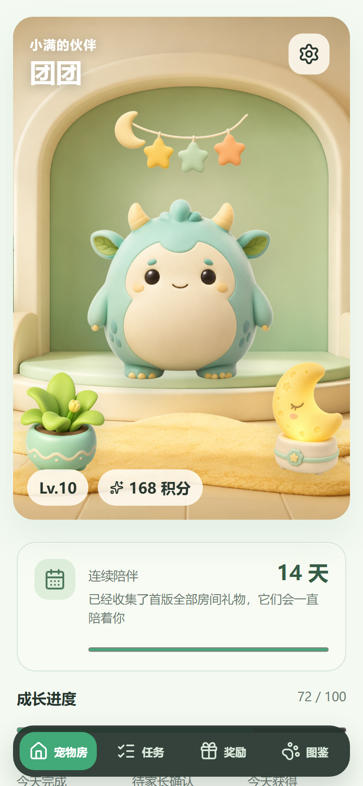
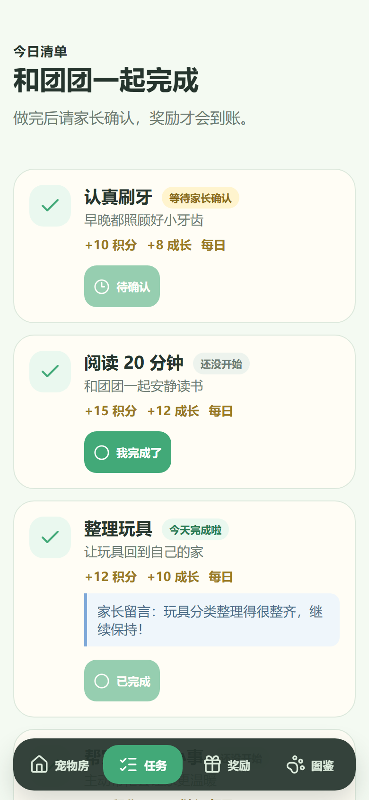
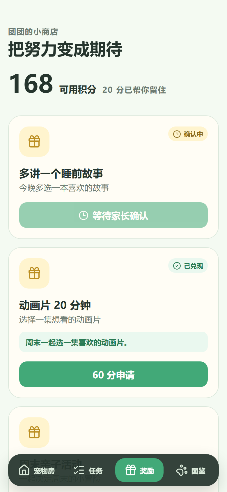
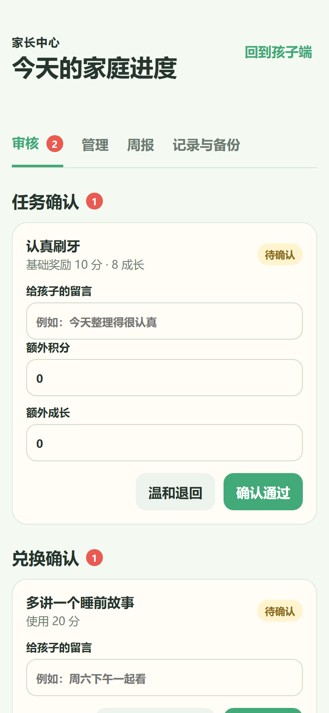

# 家庭幻兽奖励

一款本地优先的家庭任务与奖励 PWA：孩子完成任务、积累成长值并养成幻兽，家长通过 PIN 审核任务和兑现奖励，让每一次进步都有温暖、清楚的反馈。

[](https://deploy.workers.cloudflare.com/?url=https://github.com/KIVINXU/family-pets)

## 项目简介

家庭幻兽奖励面向手机浏览器和主屏幕安装场景。孩子每天可以照顾自己的幻兽、提交家庭任务、积累积分与成长值；家长负责审核、写下鼓励、管理奖励，并通过本地备份保护家庭记录。

应用不依赖账号或服务端数据库。任务、积分、宠物和兑换记录保存在当前浏览器的 IndexedDB 中，离线也能继续使用。

## 页面预览

<table>
  <tr>
    <th>宠物房与成长反馈</th>
    <th>每日任务</th>
  </tr>
  <tr>
    <td></td>
    <td></td>
  </tr>
  <tr>
    <th>积分奖励</th>
    <th>家长中心</th>
  </tr>
  <tr>
    <td></td>
    <td></td>
  </tr>
</table>

## 功能亮点

### 孩子端

- 提交每日任务，查看待确认、已完成和家长反馈。
- 使用可用积分申请奖励，清楚区分确认中、待兑现和已兑现状态。
- 通过成长值提升等级，逐步解锁 5 只不同性格的幻兽。
- 领取等级里程碑和连续陪伴礼物，解锁房间装饰与专属台词。
- 在宠物房查看今日进度、积分、成长状态，并与幻兽互动。

### 家长端

- 使用本机 PIN 进入家长中心，闲置或离开家长端后自动锁定。
- 审核孩子提交的任务，发放基础积分、成长值及额外奖励。
- 确认、退回和兑现奖励申请，保留完整积分流水。
- 管理任务、奖励、孩子昵称、宠物名称和家长 PIN。
- 查看轻量周报，导出或恢复经过校验的 JSON 家庭备份。

### 本地优先 PWA

- IndexedDB 本地持久化，无需注册账号。
- Service Worker 缓存应用外壳、宠物、背景和房间装饰。
- 支持添加到主屏幕、离线打开和新版本更新提示。
- 对旧版数据和备份执行 schema 迁移与完整性校验。
- 支持减少动态效果和较大字号等可访问性场景。

## 基本使用流程

1. 首次打开时设置孩子昵称、宠物名称和 4 位家长 PIN。
2. 孩子完成任务后提交，任务进入等待家长确认状态。
3. 家长审核任务并发放积分、成长值和鼓励反馈。
4. 孩子使用积分申请奖励，家长确认后在现实中兑现。

## 一键部署到 Cloudflare

点击顶部的 **Deploy to Cloudflare** 按钮，可以把公开仓库复制到自己的 GitHub 账号，并通过 Cloudflare Workers Builds 构建和部署。

项目使用 Cloudflare Workers Static Assets 托管 `dist/`，并启用 SPA fallback，因此 Vue Router 页面可以直接访问和刷新。PWA 安装与 Service Worker 需要 HTTPS，Cloudflare 部署地址默认满足该条件。

> 在线部署不会把家庭数据上传到云端。每个浏览器和设备拥有独立的本地数据，建议定期从家长中心导出 JSON 备份。

## 本地开发

需要 Node.js 22 或更高版本。

```powershell
$ErrorActionPreference = 'Stop'
npm install
npm run dev
```

构建生产版本：

```powershell
$ErrorActionPreference = 'Stop'
npm run build
npm run preview
```

## 更新 README 截图

截图流程会启动固定手机视口，写入无隐私风险的演示数据，并重新生成 README 使用的 4 张页面截图：

```powershell
$ErrorActionPreference = 'Stop'
npm run docs:screenshots
```

## 质量检查

```powershell
$ErrorActionPreference = 'Stop'
npm run type-check
npm run test
npm run test:e2e
npm run build
npm run test:pwa
npx wrangler deploy --dry-run
```

## 技术栈

- Vue 3、Vue Router、Pinia
- TypeScript、Vite
- IndexedDB、Zod
- vite-plugin-pwa、Workbox
- Vitest、Playwright
- Cloudflare Workers Static Assets、Wrangler

## 项目文档

- [产品需求](docs/family-pet-rewards-prd.md)
- [设计方向](docs/family-pet-rewards-design-directions.md)
- [H5 产品路线图](docs/h5-product-roadmap.md)
